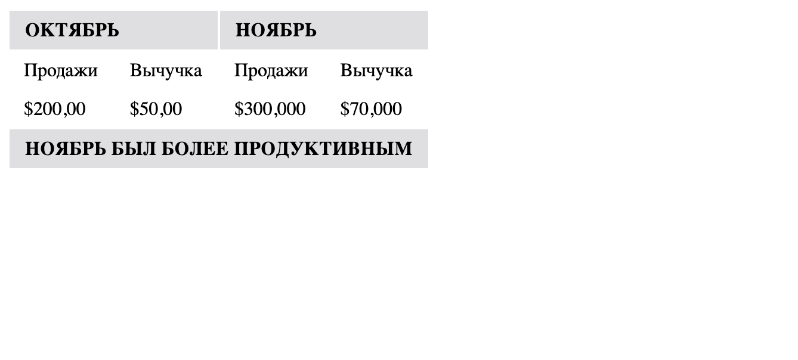

# Таблица уровня easy

Как на сайте или в любом другом документе есть три основных раздела - заголовок, тело и нижний колонтитул, так и в таблице.
В таблице они разделяются с помощью атрибутов, а именно:

<thead> - предоставляет отдельный хедер для таблицы
<tbody> - содержит основное содержимое таблицы
<tfoot> - создает отдельный нижний колонтитул для таблицы

### Подсказки

- Для применения стилей к элементам таблицы используйте селекторы `th` и `td`.
- При необходимости, обратитесь к документации CSS для получения дополнительной информации по использованию свойств.

## Желаемый результат

### Проверка
1. Используйте тэги `<thead>`, `<tbody>`, `<tfoot>`, `th`, `td` и `tr`.
2. Настройте стили для заголовков таблицы (`th`):
   - Установите отступы в 6 пикселей сверху и снизу, 12 пикселей слева и справа.
   - Установите границу толщиной 1 пиксель и цветом #dfdfe2.
   - Цвет текста должен быть черным.
   - Размер шрифта должен быть 1 рем.
   - Установите жирность шрифта на 700.
   - Установите интервал между буквами на 0.2 пикселя.
   - Выравнивание текста должно быть слева.
   - Преобразуйте текст в верхний регистр.
   - Цвет фона должен быть #dfdfe2.

3. Настройте стили для ячеек таблицы (`td`):
   - Установите отступы в 6 пикселей сверху и снизу, 12 пикселей слева и справа.

### Примечания:
- Убедитесь, что CSS правила применяются к соответствующим элементам HTML таблицы.
- Проверьте отображение таблицы в браузере после применения стилей.
- В случае необходимости, отладьте стили, чтобы добиться желаемого визуального эффекта.
- Прочитайте про colspan в использовании с table